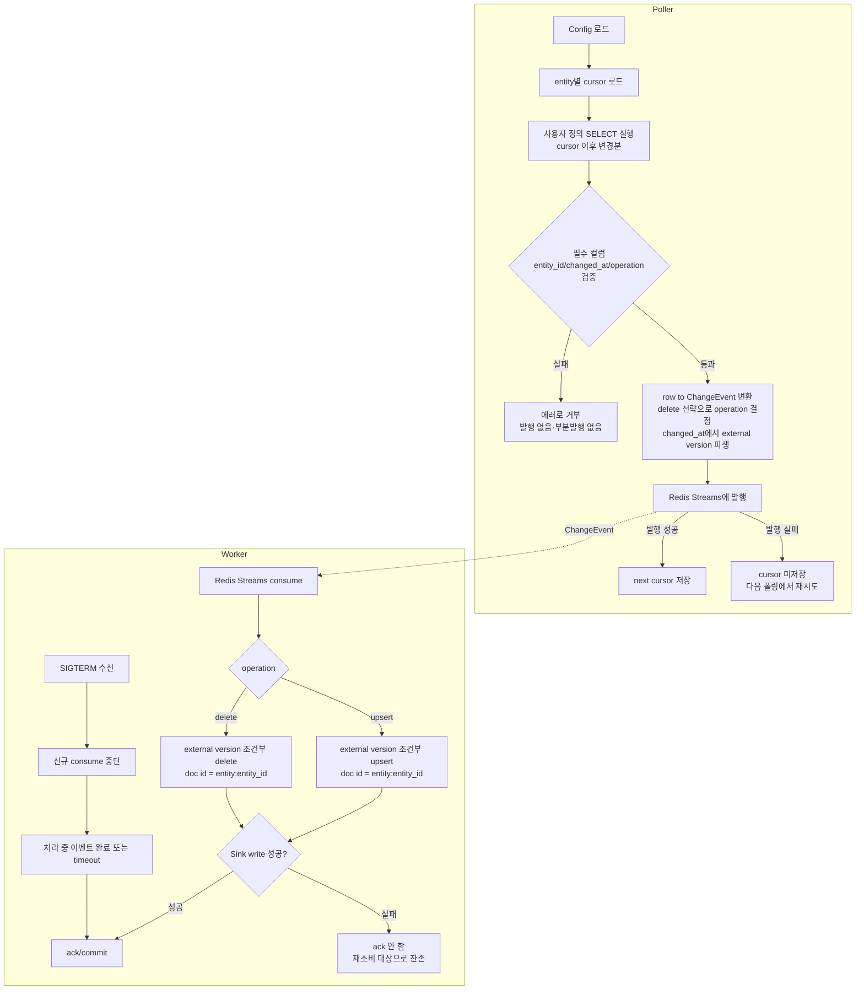

# timestamp-sync-mvp ANALYSIS

## 근거

읽은 spec.md 범위: spec.md 전체(§1 범위, §2 목표, §3 제약, §4 제외 범위, §5 완료 조건 1–9)를 읽었다.

코드베이스 확인 사실:

- 저장소는 init 커밋 상태이며 Go 소스 파일이 존재하지 않는다. 저장소 루트에는 `README.md`, `.gitignore`, `.idea/`, `docs/`만 있다. `cmd/`, `internal/`, `go.mod`는 없다.
- 따라서 이 feature가 재사용·연결·확장할 기존 패키지 경계·타입·인터페이스·DB 스키마는 없다. 모든 구조는 신규 생성이다. 기존 호출자·저장 데이터·외부 contract도 없다.
- 루트 `README.md`는 프로젝트 차원 비전 문서다. 그 안의 `## 프로젝트 구조` 패키지 트리, `SourceConnector`/`EventPublisher`/`EventConsumer` 인터페이스 스케치, `ChangeEvent` JSON 예시, `## 설정 예시` YAML, Timestamp Mode 쿼리 예시는 **기존 코드가 아니라 설계 참고 입력**이다. 이 analysis는 spec.md를 기준으로 하며, README 스케치는 spec.md 범위와 일치하는 한에서만 참고한다.
- 루트 `README.md`의 `## MVP 범위` 섹션은 프로젝트 차원 목표(Kafka·Elasticsearch·retry/DLQ·metrics·배포물 포함)로, 이번 feature 범위(spec.md §1)와 다르다. 사용자 결정(해석 A)에 따라 이번에 수정하지 않으며, 범위 판단의 기준은 spec.md다.

추정과 구분: 아래 §1–§5의 구조·인터페이스 분리는 spec.md §2(Source/Stream/Sink 경계를 인터페이스로 분리해 이후 backend·sink를 증분으로 얹는다)에 근거한 설계 판단이다. 기존 코드에서 관찰한 사실이 아니라 spec.md 목표에서 도출한 결정임을 명시한다.

## 1. 구조

이 feature는 신규 Go 프로젝트의 첫 수직 슬라이스다. spec.md §1이 경계이고, spec.md §2가 요구하는 "Source / Stream / Sink 인터페이스 분리"를 따라 경계를 다음으로 나눈다. 파일 배치가 아니라 경계 중심으로 기술한다.

- **실행 단위 (두 개의 프로세스)**: poller와 worker는 별개의 실행 엔트리포인트다 (SPEC §5.1, §5.2). 같은 설정 파일을 공유하지만 독립적으로 시작·종료한다. 둘은 코드를 직접 호출하지 않고 stream backend를 통해서만 연결된다.

- **Config 경계**: YAML 설정을 읽어 sources / stream / sink / entities / poller 설정으로 구조화한다 (SPEC §3 "설정은 YAML"). entity별 detector mode, cursor 컬럼 매핑, query 파일 경로, **delete 전략 선언값**을 담는다. delete 전략 선언이 config 경계에 속하는 이유는 spec.md §3이 delete 의미를 entity별 선언값으로만 결정하도록 제약하기 때문이다.

- **Source 경계**: MSSQL 접속과 사용자 정의 SELECT query 실행을 담당한다. 인터페이스로 분리해 향후 다른 DB connector가 같은 경계에 얹히게 한다 (SPEC §2). 이번 구현체는 MSSQL 하나뿐이다.

- **Detector 경계 (Timestamp Mode)**: query 결과 row를 표준 `ChangeEvent`로 변환한다. 필수 결과 컬럼(`entity_id`, `changed_at`, `operation`) 검증, delete 전략에 따른 `operation` 결정, **정렬키(`changed_at`, tie-breaker `entity_id`)에서 external version 파생**, next cursor 계산이 이 경계 안에서 일어난다 (SPEC §5.3, §5.4, §5.6, §5.8). Detector도 mode 인터페이스로 분리해 향후 Version/Snapshot Mode가 같은 경계에 얹히게 한다 (SPEC §2). 이번 구현체는 Timestamp Mode 하나뿐이다.

- **Cursor Store 경계**: source + entity + mode 단위 cursor를 프로세스 재시작을 가로질러 영속한다 (SPEC §3, §5.7). poller만 사용한다. 인터페이스로 분리해 향후 저장소 교체가 가능하게 한다.

- **Stream 경계 (publisher / consumer)**: `ChangeEvent` 발행과 소비를 담당하며, poller와 worker를 잇는 유일한 연결점이다. 이번 구현체는 Redis Streams 하나뿐이지만, publisher/consumer를 인터페이스로 분리해 향후 Kafka가 같은 경계에 얹히게 한다 (SPEC §2). consumer 측은 ack/commit, consumer group, pending 재소비를 노출해야 한다 (SPEC §5.9의 미-ack 재소비 요건이 이 경계에서 충족됨).

- **Sink 경계**: `ChangeEvent`를 OpenSearch 문서에 반영한다. 안정적 document ID 생성(`entity:entity_id`), external version 기반 조건부 쓰기(upsert/delete), idempotency가 이 경계 안에서 일어난다 (SPEC §5.2, §5.3, §5.5, §5.6). 이번 구현체는 OpenSearch 하나뿐이지만 인터페이스로 분리해 향후 Elasticsearch가 같은 경계에 얹히게 한다 (SPEC §2).

- **Model 경계**: `ChangeEvent`와 cursor 표현을 공통 타입으로 둔다. poller·worker·stream·sink가 모두 의존하는 가장 안쪽 경계다.

poller 실행 단위는 Config → Source → Detector → Cursor Store → Stream(publisher)를 조립한다. worker 실행 단위는 Config → Stream(consumer) → Sink를 조립한다. 두 실행 단위는 서로의 내부 경계를 직접 참조하지 않는다.

## 2. 데이터 흐름

비선형 지점이 두 곳 있다: (a) cursor 저장 시점이 발행 성공 뒤로 강제되는 것, (b) worker의 ack가 sink write 성공 뒤로 강제되며 SIGTERM 시 분기가 생기는 것.

상태 전이의 핵심:

- **cursor 상태**: 초기 cursor → 발행 성공 시에만 (`changed_at`, `entity_id`)로 전진. 발행 실패 시 전진하지 않아 재시작 시 마지막 저장 지점부터 재개한다. 이미 발행된 변경의 중복 재발행은 허용되고 누락은 없다 (SPEC §5.7). 이 시점 강제가 §2의 비선형 지점 (a)다.

- **operation 결정 상태**: entity의 delete 전략 선언값이 입력이다. `none` 선언 entity는 어떤 row에 대해서도 `delete`를 만들지 않고 항상 `upsert`만 발행한다 (SPEC §5.4). `soft_delete_in_query` 선언 entity는 row의 `operation` 컬럼 값을 그대로 신뢰해 upsert/delete를 발행한다 (SPEC §5.3). 플랫폼은 SQL 의미를 추론하지 않는다 (SPEC §3).

- **external version 상태**: detector 정렬키에서 파생된 단조 비감소 값이 ChangeEvent에 실린다. Timestamp Mode에서는 `changed_at` 기반 (SPEC §3, §5.6). sink는 문서의 현재 external version보다 크거나 같을 때만 쓰기를 적용하는 조건부 쓰기로 out-of-order 덮어쓰기를 막는다.

- **worker ack 상태**: consume → 처리 → sink write 성공 시에만 ack/commit. 실패 시 미-ack 상태로 남아 재소비 대상이 된다. 같은 이벤트가 중복 전달돼도 안정적 document ID + idempotent 조건부 쓰기로 최종 문서 상태가 한 번 처리한 경우와 동일하다 (SPEC §5.5). SIGTERM 시에는 신규 consume를 멈추고 처리 중 이벤트를 완료(또는 timeout) 후 ack하고 종료하며, sink write에 성공 못한 이벤트는 ack되지 않는다 (SPEC §5.9). 이 강제·분기가 §2의 비선형 지점 (b)다.

외부 통합 지점: MSSQL(읽기 전용 SELECT), Redis Streams(publish/consume + consumer group ack), OpenSearch(조건부 upsert/delete), cursor 영속 저장소.

## 3. 인터페이스

경계를 가로지르는 계약만 기술한다. 내부 helper는 범위 밖이다.

- **`ChangeEvent` (Model 경계 계약)**: poller가 생성하고 stream을 통과해 worker·sink가 소비하는 표준 이벤트. 필수 의미 필드: `source`, `entity`, `entity_id`, `operation`(`upsert`|`delete`), `changed_at`, sink 조건부 쓰기에 쓸 **external version**(Timestamp Mode에서 `changed_at` 파생), `payload`(query가 반환한 컬럼들). document ID는 `entity` + `:` + `entity_id`로 안정적으로 파생된다 (SPEC §5.2, §5.5). 중복 전달 식별을 위한 이벤트 고유 식별자를 포함한다. 정확한 필드 직렬화 형태(JSON 키, version 인코딩)는 Decision Point로 둔다.

- **Source connector 계약**: 컨텍스트와 사용자 정의 SELECT query, cursor 파생 파라미터를 받아 결과 row 집합을 돌려준다. parameter binding, 안정적 정렬, limit/paging, query timeout, read-only 계정 사용을 호출 측 계약으로 전제한다 (SPEC §3). 이 경계는 MSSQL 비종속이어야 한다 (SPEC §2).

- **Detector(mode) 계약**: source row 집합 + entity 설정(cursor 컬럼 매핑, delete 전략 선언)을 받아 `ChangeEvent` 목록과 next cursor를 돌려준다. 필수 결과 컬럼 미충족 시 변경을 발행하지 않고 명확한 에러를 반환한다 (조용한 진행·부분 발행 없음) (SPEC §5.8).

- **Cursor store 계약**: (source, entity, mode) 키에 대한 cursor load/save. save는 발행 성공 이후에만 호출되는 계약 (SPEC §3, §5.7). 프로세스 재시작을 가로질러 영속.

- **Stream publisher 계약**: `ChangeEvent`를 backend에 발행하고 성공/실패를 반환한다. 성공 반환이 cursor 저장의 전제 (SPEC §3).

- **Stream consumer 계약**: `ChangeEvent`를 핸들러에 전달하고, 핸들러 성공 시에만 ack/commit한다. 미-ack 이벤트는 재소비 대상으로 남는다. consumer group / pending 재소비, graceful 종료(신규 consume 중단 + 처리 중 완료/timeout)를 노출한다 (SPEC §5.9).

- **Sink 계약**: `ChangeEvent`를 받아 `entity:entity_id` document에 대해 external version 조건부 쓰기를 수행한다. `upsert`는 조건부 색인, `delete`는 조건부 삭제. 같은 이벤트 중복 호출에 idempotent, 더 오래된 external version의 쓰기는 무시 (SPEC §5.2, §5.3, §5.5, §5.6).

## 4. 영향 범위

해당 없음.

저장소가 init 커밋 상태로 Go 소스가 없어, 이 feature가 건드릴 기존 모듈·파일·DB 테이블이 없다. 모든 구조가 신규 생성이며, 깨질 기존 호출자·저장 데이터·외부 contract가 존재하지 않으므로 하위 호환·마이그레이션 항목도 없다. 루트 `README.md`의 `## MVP 범위`는 사용자 결정(해석 A)에 따라 이번 feature에서 수정하지 않는다.

## 5. Decision Points

### DP1. Detector·Stream·Sink를 단일 mvp 경로로 인라인할지, 인터페이스로 분리할지

- 옵션 A: Timestamp/Redis/OpenSearch만 있으므로 추상화 없이 직선 코드로 작성.
- 옵션 B: Source/Detector/Stream/Sink를 인터페이스로 분리하되 구현체는 각 하나만.
- 트레이드오프: A는 코드량이 적고 빠르지만, 이후 Kafka·Elasticsearch·Version/Snapshot Mode를 얹을 때 경로를 재작성해야 한다. B는 초기 보일러플레이트가 늘지만 후속 feature가 같은 경계에 증분으로 얹힌다.
- 채택: B.
- 근거: spec.md §2가 "Source/Stream/Sink 경계를 인터페이스로 분리한 골격을 세워 이후 Kafka·Elasticsearch·retry/DLQ·metrics를 증분으로 얹는다"를 명시적 목표로 둔다. 단, 인터페이스만 분리하고 다중 구현체·미사용 추상화는 spec.md §4 제외 범위이므로 만들지 않는다.

### DP2. external version의 파생·인코딩 방식

- 옵션 A: `changed_at` 타임스탬프를 그대로 sink version으로 사용 (tie-breaker 미반영).
- 옵션 B: 정렬키 `(changed_at, entity_id)` 전체를 단조 비감소 정수/문자열로 인코딩해 version으로 사용.
- 트레이드오프: A는 단순하나, 같은 `changed_at`에 여러 row가 있을 때(README가 cursor에 `entity_id`를 함께 쓰는 이유로 든 상황) 같은 version이 되어 동일 timestamp 내 순서를 조건부 쓰기로 보장하지 못한다. B는 정렬키 전체 단조성을 version에 반영하나 인코딩 규칙이 필요하다.
- 채택: B 방향(정렬키에서 파생한 단조 비감소 external version). 구체 인코딩(예: epoch 기반 정수 + tie-breaker 합성)은 구현 시 결정.
- 근거: spec.md §3이 "external version은 detector 정렬키에서 파생"하고 Timestamp Mode 정확성이 "`changed_at` 단조 비감소 + tie-breaker `entity_id`" 가정에 의존한다고 명시한다. SPEC §5.6의 out-of-order 비-덮어쓰기를 같은 timestamp 영역에서도 성립시키려면 tie-breaker가 version에 반영되어야 한다. 구체 인코딩은 정확성을 바꾸지 않는 구현 디테일이라 implement 단계로 미룬다.

### DP3. cursor 영속 저장소 선택

- 옵션 A: File 기반.
- 옵션 B: SQLite.
- 옵션 C: Redis/외부 DB.
- 트레이드오프: A는 의존성이 없고 프로세스 재시작 가로지르기에 충분하다. B는 다중 entity·동시성에 견고하나 의존성이 늘고 이번 슬라이스엔 과하다. C는 외부 인프라 추가로 §1 경계를 넓힌다.
- 채택: File 기반. 단 §3의 Cursor store 인터페이스 뒤에 둬서 이후 교체 가능하게 한다.
- 근거: spec.md §5.7이 요구하는 것은 "발행 성공 후 저장 + 재시작 시 마지막 저장 cursor 이후 재개"뿐이며, 이는 File로 충족된다. 저장소 확장은 spec.md §1 경계 밖 후속 작업이고, 인터페이스 분리(DP1)로 후속 교체 비용을 낮춘다.

### DP4. delete 전략의 `operation` 결정 위치

- 옵션 A: detector가 entity의 delete 전략 선언값을 보고 `operation`을 최종 결정(`none`이면 row의 operation 무시하고 항상 upsert, `soft_delete_in_query`면 row operation 신뢰).
- 옵션 B: sink가 entity 전략을 참조해 delete를 적용/무시.
- 트레이드오프: B는 전략 지식이 sink까지 새어 stream을 통과하는 ChangeEvent 의미가 불완전해진다(같은 이벤트를 다른 sink가 다르게 해석할 여지). A는 ChangeEvent가 경계를 떠나기 전에 operation 의미가 확정돼 stream/sink가 전략을 몰라도 된다.
- 채택: A.
- 근거: spec.md §3은 delete 의미를 entity별 선언값으로만 결정하고 플랫폼이 SQL 의미를 추론하지 않도록 제약한다. operation을 detector에서 확정하면 SPEC §5.3·§5.4가 stream/sink 구현과 무관하게 detector 한 곳의 책임으로 성립하고, ChangeEvent가 전략 선언과 독립적인 자기완결 계약이 된다.

### DP5. 필수 결과 컬럼 검증 실패 시 처리 단위

- 옵션 A: row 단위 검증 — 컬럼을 못 채운 row만 건너뛰고 나머지 발행.
- 옵션 B: 배치/쿼리 단위 거부 — 필수 컬럼을 만족 못 하는 쿼리는 변경을 발행하지 않고 에러로 거부.
- 트레이드오프: A는 부분 발행이 되어 조용한 데이터 누락이 생긴다. B는 잘못 정의된 쿼리를 빠르게 드러낸다.
- 채택: B.
- 근거: spec.md §5.8이 "조용히 진행하거나 부분 발행하지 않는다"를 명시한다. 필수 컬럼 부재는 row 데이터 문제가 아니라 쿼리 contract 위반이므로 쿼리/결과 형태 수준에서 거부하는 것이 spec.md 의도와 일치한다.
